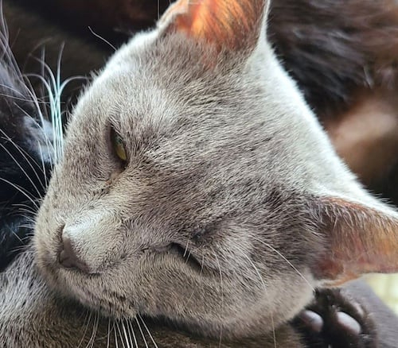

# Nightmareai/real-esrgan Cog model

This is an implementation of RiversHaveWings [StableDiffusionUpscaler](https://colab.research.google.com/drive/1o1qYJcFeywzCIdkfKJy7cTpgZTCM2EI4) as a Cog model. [Cog packages machine learning models as standard containers.](https://github.com/replicate/cog)

First, download the pre-trained weights:

    cog build -t esrgan

Then, you can run predictions:

    cog predict -i image=@cat.jpeg

## Sample

Demo image before upscaling:

Demo image after upscaling:
